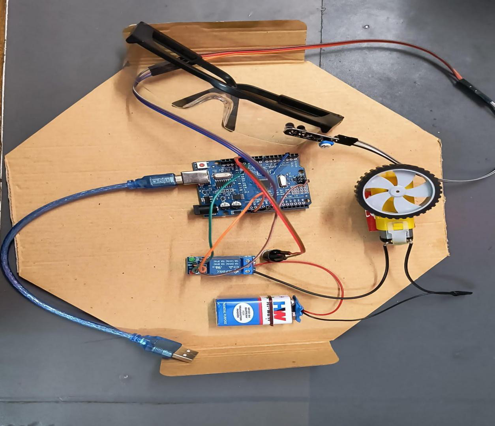
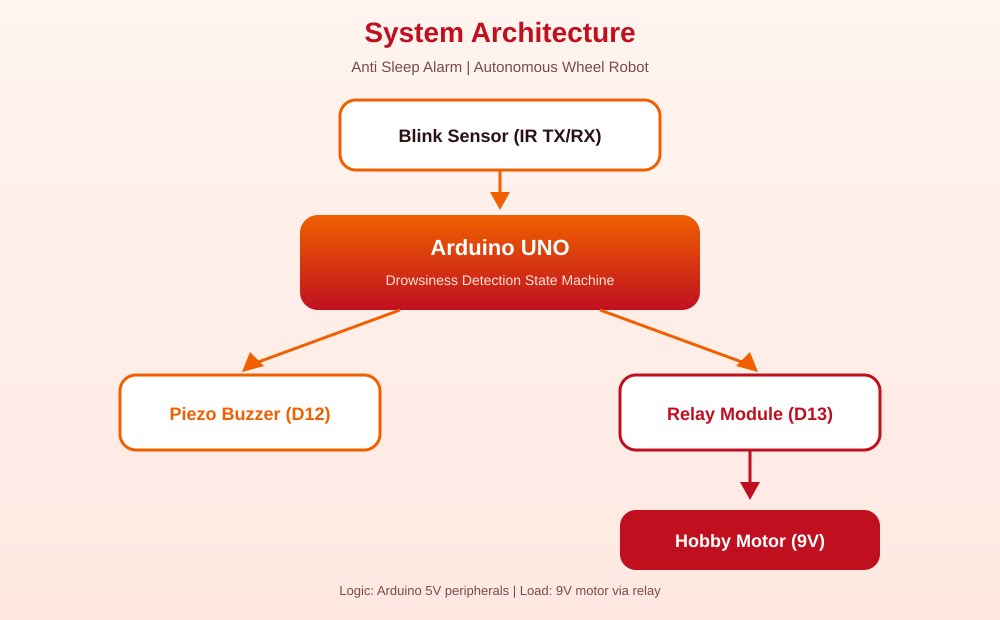
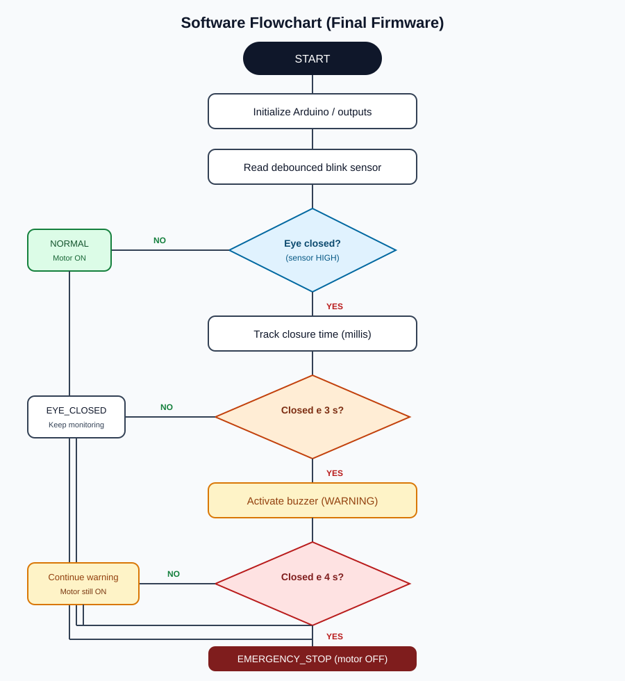

# Anti Sleep Alarm – Autonomous Wheel Robot

Arduino-based autonomous wheel robot prototype that detects prolonged eye closure using an IR blink sensor and provides an audible warning with relay-controlled motor safety response.

<p align="center">
  
</p>

<p align="center">
  
  
  
  
</p>



## Overview

This repository packages an academic hardware project into a clean, reproducible GitHub portfolio structure.

The system monitors a driver’s eye/blink state with an IR blink sensor mounted on transparent spectacles. If the eye remains closed beyond configured thresholds, the Arduino:

1. Activates a **piezo buzzer** warning
2. Switches a **relay** to stop a **hobby motor** on the wheel-robot demo platform

> This is a **low-voltage prototype** for learning and demonstration. It is **not** a certified automotive safety system and must not be connected to a real vehicle braking system.

## Problem Statement

Driver fatigue and microsleep events are significant contributors to road accidents during long drives. This project explores a simple embedded approach to:

- detect prolonged eye closure
- warn the operator audibly
- demonstrate an automatic motion-stop response on a wheel robot

## Solution

| Block | Implementation |
|-------|----------------|
| Sensing | IR blink sensor (TX + RX) on spectacles |
| Control | Arduino UNO state-machine firmware |
| Warning | Piezo buzzer on D12 |
| Safety demo actuator | Relay on D13 switching a 9V hobby motor |
| Isolation | Relay keeps motor current off Arduino GPIO pins |

## Key Features

- Eye/blink state monitoring via IR sensor
- Drowsiness timing based on prolonged eye closure
- Audible piezo warning
- Relay-based hobby motor switching
- Automatic safety stop demonstration
- Non-blocking Arduino state machine
- Configurable relay polarity
- Wiring, architecture, testing, and troubleshooting docs
- Optional Wokwi logic simulation (button substitutes for IR sensor)
- Optional static documentation website

## System Architecture



```text
Blink Sensor → Arduino UNO → Drowsiness Detection
                               ├─ Buzzer
                               └─ Relay → Hobby Motor (9V)
```

## Hardware Components

| Component | Purpose |
|-----------|---------|
| Arduino UNO | Embedded controller |
| Arduino IDE | Build/upload toolchain |
| IR blink sensor | Detects eye open/closed state |
| Transparent spectacles | Sensor mount near the eye |
| Piezo buzzer | Audible alert |
| Relay module | Switches motor load safely |
| Hobby motor + wheel | Autonomous wheel demo |
| 9V battery | Motor power supply |
| Jumper wires | Interconnections |

## Pin Configuration

| Device | Arduino Pin | Notes |
|--------|-------------|-------|
| Blink sensor OUT | D2 | VCC→5V, GND→GND |
| Piezo buzzer | D12 | Active HIGH in firmware |
| Relay IN | D13 | VCC→5V, GND→GND |
| Hobby motor | — | Powered by 9V through relay COM/NC |

Full wiring details: [`docs/wiring.md`](docs/wiring.md)

## Working Principle

1. Arduino boots and enables normal operation (motor allowed, buzzer off).
2. Blink sensor is read continuously with debounce.
3. Documented sensor polarity: **eye shut → HIGH**.
4. If closure persists:
   - **≥ 3 s** → buzzer warning
   - **≥ 4 s** → relay stops the hobby motor
5. When blinking/eye-open resumes, outputs reset to normal.

## Detection Logic

| Condition | Duration | Output |
|-----------|----------|--------|
| Normal | Eye open / short blinks | Motor ON, buzzer OFF |
| Suspicious / Warning | Eye closed ≥ **3 s** | Buzzer ON, motor ON |
| Critical / Emergency | Eye closed ≥ **4 s** | Motor OFF via relay, buzzer ON |
| Recovery | Eye opens | Return to normal |

### Timing note from the source PDF

| Source | Warning | Stop |
|--------|---------|------|
| Theory text | ~3 s | ~5 s |
| AIM + original code | — | ~4 s |
| **Final firmware** | **3 s** | **4 s** |

The repository follows the original implementation/AIM and documents the theory mismatch instead of hiding it.

### Relay polarity

Original code used:

- normal run → `motorPin = LOW`
- stop → `motorPin = HIGH`

Combined with documented **NC** motor wiring, firmware defaults to:

```cpp
const bool RELAY_ACTIVE_LOW = false; // HIGH energizes relay / stops motor
```

If your relay module is inverted, change that constant. Helpers `motorOn()` / `motorOff()` keep intent clear.

## Circuit Diagram


Original reference image from the PDF:


## Flowchart



## Repository Structure

```text
anti-sleep-alarm-robot/
├── README.md
├── LICENSE
├── .gitignore
├── arduino/anti_sleep_alarm/anti_sleep_alarm.ino
├── docs/
│   ├── architecture.md
│   ├── wiring.md
│   ├── hardware.md
│   ├── software.md
│   ├── testing.md
│   ├── troubleshooting.md
│   └── project-report.md
├── diagrams/
│   ├── system-architecture.svg
│   ├── circuit-diagram.svg
│   └── system-flowchart.svg
├── media/
├── simulation/wokwi/
├── website/
└── original/
```

## Installation

1. Install [Arduino IDE](https://www.arduino.cc/en/software)
2. Connect Arduino UNO over USB
3. Open `arduino/anti_sleep_alarm/anti_sleep_alarm.ino`
4. Select board: **Arduino UNO**
5. Select the correct **COM port**
6. Upload the sketch
7. Wire hardware as documented in [`docs/wiring.md`](docs/wiring.md)
8. Power the 9V motor circuit through the relay and test the sensor

## How to Run

1. Upload firmware
2. Wear/align the blink-sensor spectacles (or stimulate the IR path for bench testing)
3. Confirm motor runs in normal state
4. Hold eye closed:
   - at ~3 s hear buzzer
   - at ~4 s observe motor stop
5. Open eyes / resume blinking to reset
6. Optional: open Serial Monitor at **115200** baud for state logs

## Testing

See [`docs/testing.md`](docs/testing.md) for full scenarios.

| Test | Expected |
|------|----------|
| Normal blinking | Motor ON, buzzer OFF |
| Eye closed ≥ 3 s | Buzzer ON |
| Eye closed ≥ 4 s | Motor safety stop |
| Blink resumes | Reset to normal |

## Engineering Improvements

| Original | Improved | Reason |
|----------|----------|--------|
| Blocking `while` + `delay(1000)` | Non-blocking state machine | Responsive control loop |
| Uninitialized timer variable | Timer starts on validated closure | Deterministic timing |
| Magic numbers | Named threshold constants | Maintainability |
| Raw motor pin semantics | `motorOn()` / `motorOff()` + polarity flag | Safer across relay modules |
| No debounce | 50 ms debounce | Noise rejection |
| Implicit modes | `NORMAL` / `EYE_CLOSED` / `WARNING` / `EMERGENCY_STOP` | Clear behavior |

Details: [`docs/software.md`](docs/software.md)

## Simulation

Optional Wokwi package: [`simulation/`](simulation/)

- Button input substitutes for the physical IR blink sensor
- Useful for logic/timing checks
- Does **not** fully replace hardware validation

## Documentation Website

Optional static site: [`website/`](website/)

GitHub Pages can host `/website` (or docs folder) if enabled on the repository.

## Project Demonstration

Links from the original documentation:

- [Working video](https://drive.google.com/file/d/1kCcJM2rvE6KjCAY2x27UCMJ8hakX_5YS/view?usp=drive_link)
- [Explanation video](https://drive.google.com/file/d/19Enz9IXtXWdgx-ZpXkAhTIcgSXLgRXcD/view?usp=drive_link)

These resolve to Google Drive files (`video1.mp4`, `video2.mp4`). Public playback depends on the Drive sharing permissions set by the owner.

## Safety Notes

- Prototype / academic demonstration only
- Not certified for real-vehicle operation
- Do **not** connect to a real vehicle braking system
- Use a low-voltage hobby motor only
- Verify relay COM/NC wiring before applying motor power
- Never drive the motor directly from an Arduino GPIO
- Avoid short circuits; confirm polarity before power-up
- Supervise battery-powered tests

## Individual Contribution

**Ankit Biswas**  
Student ID: **22052533**  
Course: **CSE-3**

Primary contribution recorded in the source PDF: **documentation**, including:

- research
- technical writing
- editing and formatting
- incorporating visuals
- review and revision

Team members listed in the source document: Sudeep Dutta, Dipanwita Sen, Ankit Biswas, Pratik Maity.

## Verification Status

| Item | Status |
|------|--------|
| Firmware + docs implemented from PDF source | IMPLEMENTED |
| Relay polarity made configurable + documented | IMPLEMENTED |
| Diagrams/README/testing package | IMPLEMENTED |
| Google Drive demo links exist in docs | DOCUMENTED (permission-dependent) |
| Arduino CLI compile in packaging environment | NOT AVAILABLE HERE |
| Physical hardware re-test in this environment | REQUIRES PHYSICAL HARDWARE TESTING |

## License

MIT License — see [`LICENSE`](LICENSE)
