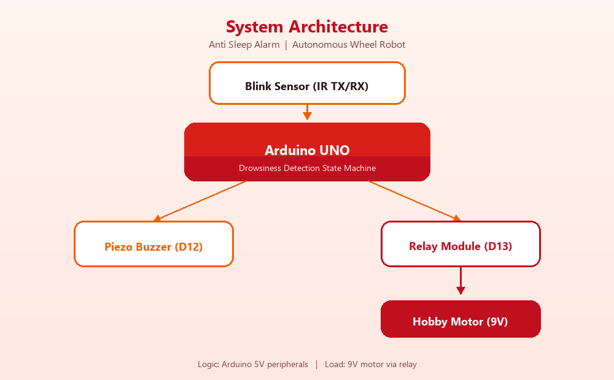
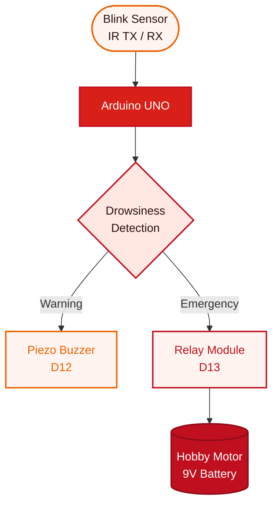
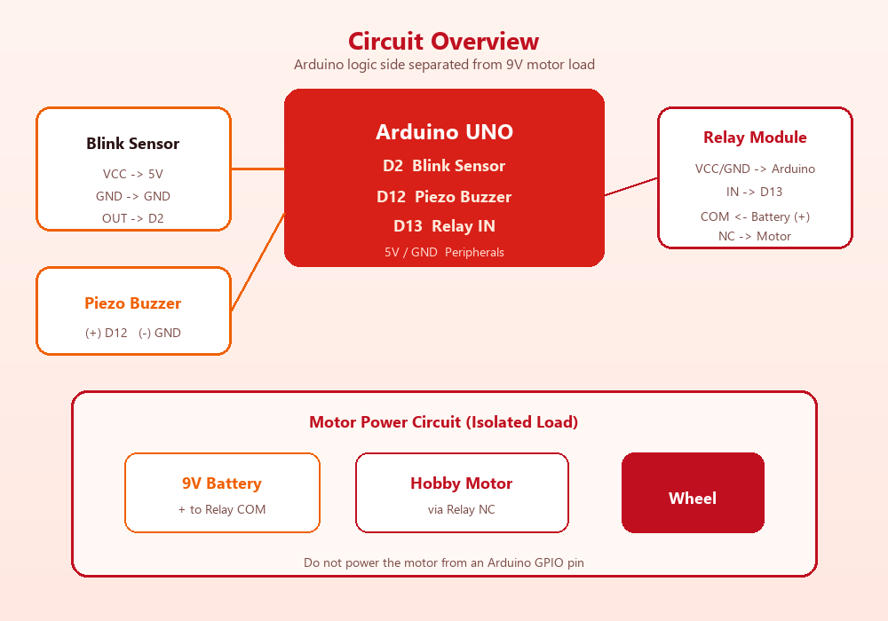
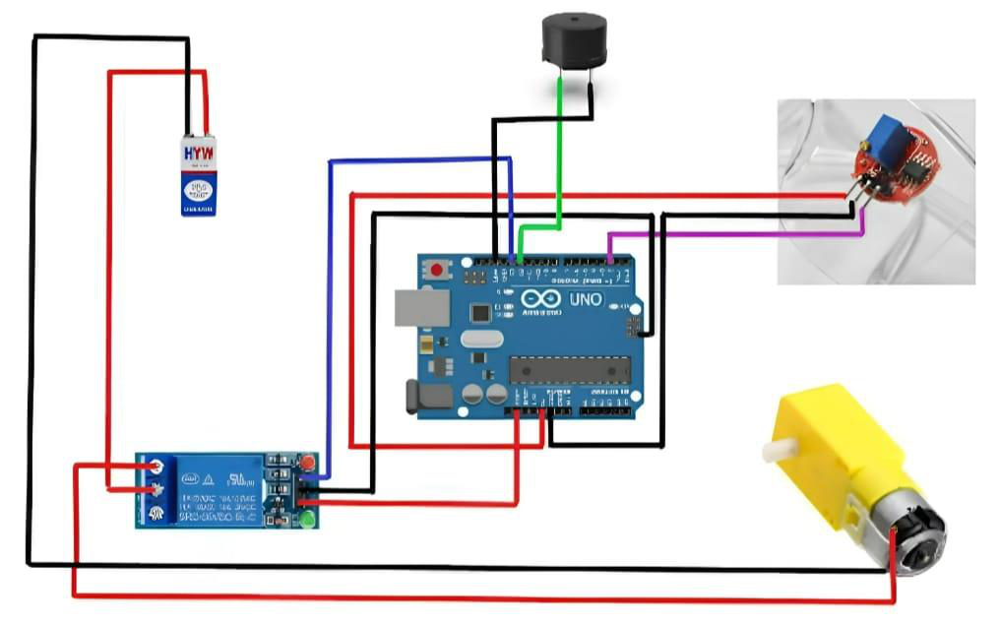
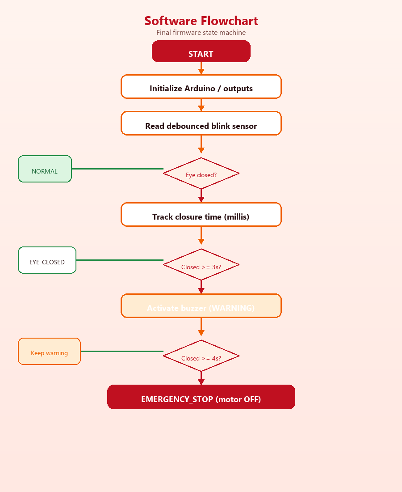

<div align="center">


# Anti Sleep Alarm – Autonomous Wheel Robot

**Arduino-based wheel-robot prototype that detects prolonged eye closure with an IR blink sensor, sounds a piezo warning, and stops the motor through a relay.**

<br/>


<br/>


<br/>

| [Overview](#-overview) | [Architecture](#-system-architecture) | [Hardware](#-hardware-components) | [Firmware](#-detection-logic) | [Docs](#-documentation) | [Safety](#-safety-notes) |
|:---:|:---:|:---:|:---:|:---:|:---:|

</div>

---

## 📌 Overview

This repository turns an academic hardware project into a clean, reproducible GitHub portfolio package.

The system monitors eye/blink state using an IR blink sensor mounted on transparent spectacles. If the eye stays closed beyond configured thresholds, the Arduino:

1. **Warns** the operator with a piezo buzzer  
2. **Stops** a hobby motor through a relay on the wheel-robot demo platform  

> ⚠️ **Prototype only** — low-voltage educational demonstration.  
> Not a certified automotive safety system. Do **not** connect it to a real vehicle braking system.

---

## 🎯 Problem Statement

Driver fatigue and microsleep events contribute to road accidents on long drives. This project explores a simple embedded approach to:

- detect prolonged eye closure  
- warn the operator audibly  
- demonstrate an automatic motion-stop response on a wheel robot  

---

## ✅ Key Features

| Feature | Supported |
|---------|-----------|
| Eye / blink state monitoring (IR sensor) | ✅ |
| Drowsiness timing on prolonged eye closure | ✅ |
| Audible piezo warning | ✅ |
| Relay-based hobby motor switching | ✅ |
| Automatic safety-stop demonstration | ✅ |
| Non-blocking Arduino state machine | ✅ |
| Configurable relay polarity | ✅ |
| Wiring / testing / troubleshooting docs | ✅ |
| Optional Wokwi logic simulation | ✅ |
| Optional static documentation website | ✅ |

---

## 🏗️ System Architecture

<div align="center">
  
</div>



**Signal flow**

```text
Blink Sensor  →  Arduino UNO  →  Drowsiness Detection
                                      ├─ Buzzer (D12)
                                      └─ Relay (D13) → Hobby Motor (9V)
```

---

## 🔧 Hardware Components

| Component | Purpose |
|-----------|---------|
| Arduino UNO | Embedded controller |
| Arduino IDE | Build / upload toolchain |
| IR blink sensor | Detects eye open / closed state |
| Transparent spectacles | Sensor mount near the eye |
| Piezo buzzer | Audible alert |
| Relay module | Switches motor load safely |
| Hobby motor + wheel | Autonomous wheel demo |
| 9V battery | Motor power supply |
| Jumper wires | Interconnections |

### Pin Configuration

| Device | Arduino Pin | Notes |
|--------|-------------|-------|
| Blink sensor `OUT` | **D2** | VCC → 5V, GND → GND |
| Piezo buzzer | **D12** | Active HIGH |
| Relay `IN` | **D13** | VCC → 5V, GND → GND |
| Hobby motor | — | Powered by **9V through relay COM / NC** |

Full wiring guide: [`docs/wiring.md`](docs/wiring.md)

---

## ⚙️ Working Principle

1. Arduino boots into normal operation *(motor allowed, buzzer off)*.  
2. Blink sensor is read continuously with debounce.  
3. Documented sensor polarity: **eye shut → HIGH**.  
4. If closure persists:
   - **≥ 3 s** → buzzer warning  
   - **≥ 4 s** → relay stops the hobby motor  
5. When blinking / eye-open resumes → system resets to normal.  

---

## 🧠 Detection Logic

| State | Condition | Outputs |
|-------|-----------|---------|
| **Normal** | Eye open / short blinks | Motor ON · Buzzer OFF |
| **Warning** | Eye closed ≥ **3 s** | Motor ON · Buzzer ON |
| **Emergency** | Eye closed ≥ **4 s** | Motor OFF · Buzzer ON |
| **Recovery** | Eye opens again | Return to Normal |

<details>
<summary><strong>Timing note from the source PDF</strong></summary>

| Source | Warning | Stop |
|--------|---------|------|
| Theory text | ~3 s | ~5 s |
| AIM + original code | — | ~4 s |
| **Final firmware** | **3 s** | **4 s** |

The repository follows the original implementation / AIM and documents the theory mismatch instead of hiding it.

</details>

<details>
<summary><strong>Relay polarity</strong></summary>

Original code used:

- normal run → `motorPin = LOW`
- stop → `motorPin = HIGH`

With documented **NC** motor wiring, firmware defaults to:

```cpp
const bool RELAY_ACTIVE_LOW = false; // HIGH energizes relay / stops motor
```

If your module is inverted, flip that constant. Helpers `motorOn()` / `motorOff()` keep intent clear.

</details>

---

## 🔌 Circuit Diagram

<div align="center">
  
</div>

<details>
<summary><strong>Original circuit image from the academic PDF</strong></summary>

<br/>

<div align="center">
  
</div>

</details>

---

## 🔀 Software Flowchart

<div align="center">
  
</div>

---

## 📁 Repository Structure

```text
anti-sleep-alarm/
├── README.md                 ← start here
├── LICENSE
├── .gitignore
│
├── firmware/                 ← Arduino code (upload this)
│   └── anti_sleep_alarm/
│       └── anti_sleep_alarm.ino
│
├── docs/                     ← written guides (read in order)
│   ├── README.md             ← docs index
│   ├── architecture.md
│   ├── hardware.md
│   ├── wiring.md
│   ├── software.md
│   ├── testing.md
│   ├── troubleshooting.md
│   └── project-report.md
│
├── hardware/                 ← diagrams + photos
│   ├── diagrams/
│   └── images/
│
├── simulation/               ← optional Wokwi logic sim
│   └── wokwi/
│
├── website/                  ← portfolio documentation site
│   ├── index.html
│   ├── css/
│   ├── js/
│   └── assets/
│
└── archive/                  ← original academic PDF
```

**Where should I look?**

| I want to… | Go to |
|------------|--------|
| Upload code to Arduino | [`firmware/`](firmware/) |
| Understand wiring | [`docs/wiring.md`](docs/wiring.md) |
| See diagrams / photos | [`hardware/`](hardware/) |
| Browse the project site | [`website/`](website/) |
| Read the original PDF | [`archive/`](archive/) |

---

## 🚀 Installation

1. Install [Arduino IDE](https://www.arduino.cc/en/software)  
2. Connect Arduino UNO over USB  
3. Open `firmware/anti_sleep_alarm/anti_sleep_alarm.ino`  
4. Select board: **Arduino UNO**  
5. Select the correct **COM port**  
6. Upload the sketch  
7. Wire hardware per [`docs/wiring.md`](docs/wiring.md)  
8. Power the 9V motor circuit through the relay and test the sensor  

---

## ▶️ How to Run

1. Upload firmware  
2. Align the blink-sensor spectacles (or stimulate the IR path for bench testing)  
3. Confirm motor runs in normal state  
4. Hold eye closed:
   - ~**3 s** → hear buzzer  
   - ~**4 s** → observe motor stop  
5. Open eyes / resume blinking to reset  
6. Optional: Serial Monitor at **115200** baud for state logs  

---

## 🧪 Testing

| Test | Expected |
|------|----------|
| Normal blinking | Motor ON, buzzer OFF |
| Eye closed ≥ 3 s | Buzzer ON |
| Eye closed ≥ 4 s | Motor safety stop |
| Blink resumes | Reset to normal |

Full scenarios: [`docs/testing.md`](docs/testing.md)

---

## 🛠️ Engineering Improvements

| Original | Improved | Reason |
|----------|----------|--------|
| Blocking `while` + `delay(1000)` | Non-blocking state machine | Responsive control loop |
| Uninitialized timer | Timer starts on validated closure | Deterministic timing |
| Magic numbers | Named threshold constants | Maintainability |
| Raw motor pin semantics | `motorOn()` / `motorOff()` + polarity flag | Safer across modules |
| No debounce | 50 ms debounce | Noise rejection |
| Implicit modes | `NORMAL` / `EYE_CLOSED` / `WARNING` / `EMERGENCY_STOP` | Clear behavior |

Details: [`docs/software.md`](docs/software.md)

---

## 📚 Documentation

| Document | Description |
|----------|-------------|
| [`docs/README.md`](docs/README.md) | Documentation index (start here) |
| [`docs/architecture.md`](docs/architecture.md) | System architecture |
| [`docs/wiring.md`](docs/wiring.md) | Pinout & wiring |
| [`docs/hardware.md`](docs/hardware.md) | Components & BOM |
| [`docs/software.md`](docs/software.md) | Firmware design |
| [`docs/testing.md`](docs/testing.md) | Test plan |
| [`docs/troubleshooting.md`](docs/troubleshooting.md) | Common issues |
| [`docs/project-report.md`](docs/project-report.md) | Project report summary |
| [`firmware/`](firmware/) | Arduino source |
| [`hardware/`](hardware/) | Diagrams & photos |
| [`website/`](website/) | Portfolio site (deploy this on Vercel) |
| [`simulation/`](simulation/) | Optional Wokwi simulation |
| [`archive/`](archive/) | Original academic PDF |

### Deploy website on Vercel

1. Open [vercel.com/new](https://vercel.com/new) and import `Ankit2004-web/anti-sleep-alarm`
2. Set **Root Directory** to `website`
3. Framework: **Other** · leave build command empty
4. Deploy

Details: [`website/README.md`](website/README.md)

---

## 🎬 Project Demonstration

| Demo | Link |
|------|------|
| Working video | [Google Drive](https://drive.google.com/file/d/1kCcJM2rvE6KjCAY2x27UCMJ8hakX_5YS/view?usp=drive_link) |
| Explanation video | [Google Drive](https://drive.google.com/file/d/19Enz9IXtXWdgx-ZpXkAhTIcgSXLgRXcD/view?usp=drive_link) |

> Playback depends on Google Drive sharing permissions set by the owner.

---

## 🛡️ Safety Notes

- Prototype / academic demonstration only  
- Not certified for real-vehicle operation  
- Do **not** connect to a real vehicle braking system  
- Use a low-voltage hobby motor only  
- Verify relay COM / NC wiring before applying motor power  
- Never drive the motor directly from an Arduino GPIO  
- Avoid short circuits; confirm polarity before power-up  
- Supervise battery-powered tests  

---

## 👤 Individual Contribution

**Ankit Biswas** · Student ID **22052533** · **CSE-3**

Primary contribution recorded in the source PDF: **documentation**

- Research  
- Technical writing  
- Editing and formatting  
- Incorporating visuals  
- Review and revision  

**Team:** Sudeep Dutta · Dipanwita Sen · Ankit Biswas · Pratik Maity  

---

## ✔️ Verification Status

| Item | Status |
|------|--------|
| Firmware + docs from PDF source | **IMPLEMENTED** |
| Relay polarity configurable + documented | **IMPLEMENTED** |
| Diagrams / README / testing package | **IMPLEMENTED** |
| Demo video links | **DOCUMENTED** *(permission-dependent)* |
| Arduino CLI compile here | Not available on this machine |
| Physical hardware re-test here | Requires physical hardware testing |

---

<div align="center">

### License

MIT License — see [`LICENSE`](LICENSE)

<br/>


**Anti Sleep Alarm** — Embedded systems portfolio project

[Repository](https://github.com/Ankit2004-web/anti-sleep-alarm) · [Arduino Firmware](firmware/anti_sleep_alarm/anti_sleep_alarm.ino) · [Wiring Guide](docs/wiring.md)

</div>
